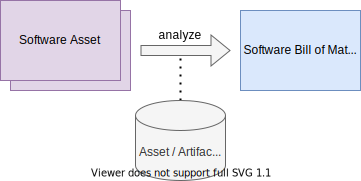

# Creating an SBOM from Software Assets

An SBOM represents knowledge and insights on one or more Software Assets. 
Such information can be either gathered manually or applying tools producing 
SBOMs based in different inputs.

Tools may be specifically used in continuous integration environment to anticipate
changes in the underlying Software Assets and produce correlating SBOMs.

When creating an SBOM it is of relevance for what purpose the SBOM is 
produced. Depending on the downstream use cases different sets of information are
required.

In the following different key aspects are considered.

## Software Representations

Software has many representations. When referring to Software either the **source 
code**, the **binary** or the **distribution** representation is meant.

It is essential for downstream use cases what **software representation is of 
interest**. Assuming that the Software Assets are the target of interest, an SBOM shall 
cover the information detailing the assets, no matter which representation is used,
to convey the information to a recipient (e.g., an operator or business partner).

It is important to note, that dependencies on source level may not necessarily be
part of the binary or distribution representation. The interpretation of dependencies 
strongly depends on the technology applied to build the binary from source and
the exact build configuration.

## Unique Identification / Precise Details

The SBOM should uniquely identify the Software Artifacts and complement 
precise information of the Software Artifacts. Ambiguities may confuse 
Software Artifacts. Imprecision on attribute-level may induce false 
conclusions.

## Completeness

The benefit of downstream results from an SBOM relies on the completeness of the SBOM.
In case the SBOM is incomplete, the derived conclusions may be incomplete. If the SBOM
is inaccurate, the downstream results may be imprecise.

Completeness validation can either be based on automated validation rules applied to an SBOM. Such rules can cover:
* consistency checks based on **SBOM structure** (hierarchy, relationships, granularity)
* consistency checks based on **SBOM content** (semantics)
* validation of **SBOM-declared information against internal knowledge**

Another approach for the validation of completeness are reviews and explorative audits. While reviews try to establish
an overall status quo, explorations are dedicated to in depth analysis focusing on specific artifacts or modes of 
integration.  

Back to [SBOM Essentials](../README.md#SBOM-Essentials).