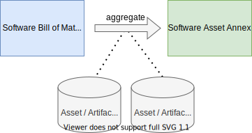

# Creating Software Documentation using SBOM

Based on an SBOM further compliance documents can be created. 

Please note, that an SBOM as such does not necessarily address compliance requirements. Related aspects are covered 
subsequently.

## Requirements for Compliance

* Effective license determination
* Justification with respect to copyleft and other reciprocal effects  
* Written offer
* Corresponding License Text
* Source Code (depending on source code handling)
* Compulsory statements regarding individual license obligations
