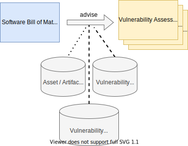

# Monitoring Vulnerabilities using SBOM

Based on SBOMs outputs supporting vulnerability monitoring and vulnerability assessment can be generated.

## Vulnerability Assessment Context

The assessment of vulnerabilities depends on the integration and deployment context. A vulnerability within a single
Software Artifact may impose a critical issue in one context while being insignificant in another context.

## Vulnerability Assessment Process

Vulnerability assessment is not trivial. It is subject to a dedicated process by specific roles.

## Capturing Reusable Vulnerability Assessment Results

Vulnerability assessment for different assets in different deployments need to organized in reusable fashion. To 
foster reuse additional concepts are required.

## Vulnerability Reassessment

It is essential to note, that vulnerability assessments may be a snapshot at a given time. The boundary conditions may
change or erode. Therefore, assessment reviews need to be conducted. These activities need to be captured by a 
Vulnerability Assessment Process.

## Excessive Vulnerabilities

Vulnerability monitoring and assessment may face a significant amount of vulnerabilities to process. Techniques are 
required to enable bulk vulnerability processing and skim the relevant threats for prioritization.