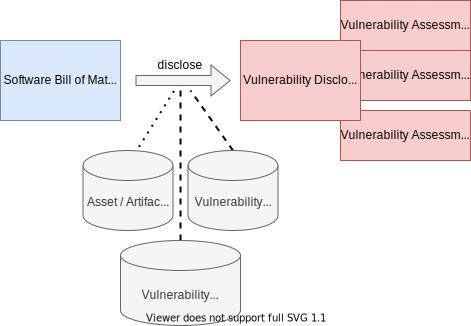

# Reporting Vulnerabilities using an SBOM

Vulnerability reports (for external recipients) can be produced from SBOMs:

Depending on the assessment context relevant for a software configuration of interest, the
resulting Vulnerability Disclosure Report contains different sections representing the assessment
contexts.

Different Vulnerability Disclosure Reports may be negotiated with the recipient. In particular, a 
variation of scope is possible:
* Vulnerability Delta Reports usually based on time periods
* Vulnerability Alert Reports using selected CERT alerts and advisories as indication for an alert.
* A combination of the above.

Back to [SBOM Essentials](../README.md#SBOM-Essentials).