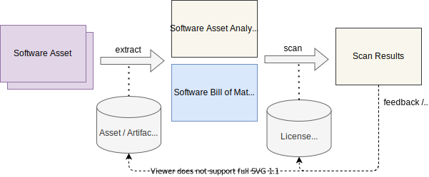
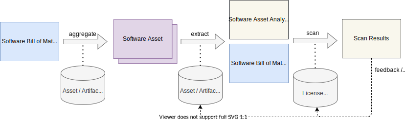

# Scanning Software based on an SBOM

Usually, license scanning works with Software Assets. An extraction process produces both an analysis structure as well 
as an SBOM. The license scanner results are then aligned with the SBOM content.

In case only an SBOM is available, an aggregation process is prepended:

## License Data

The license scanner required detailed license information. A database of licenses to differentiate the exact license
text is required.